# FlowPDF tutorial

This tutorial explains, step-by-step, how to build a simple plugin.

After this tutorial you will have a simple, but working plugin.

We will be building MyJenkins plugin that has only one procedure, that retrieves a last build number from jenkins job, and sets it to the output parameter.

## What we will be doing?

Our steps are:

0. Generate plugin specs.
0. Edit plugin specs.
0. Generate a plugin out of the specs.
0. Write our logic using FlowPDF.
0. Test plugin.

## Prerequisites

Before we go, please make sure that you have following things ready.

0. CloudBees Flow instance.
0. Machine with Docker (might be the same machine, where CloudBees Flow is installed). This machine should be visible from CloudBees Flow instance.
0. Internet connection.
0. Installed flowdpk tool.

If you don't have Docker or CloudBees Flow installed, please, do it and proceed.

To build real-world plugin we need to have a real world software to be an endpoint for our plugin. The simplest way to get this software is to use docker.
We will be downloading a docker image for jenkins that is already configured.

### Pulling docker image for Jenkins and running a container with Jenkins

Jenkins image, that we will be using is: electricflow/jenkins.

To pull it:

```
docker pull electricflow/jenkins
```

**Important:** if your docker command is failing with insufficient permissions, try it as sudo docker. This applies for each docker call in this tutorial.

After that you can run jenkins and confirm that it works:

```
docker run  -p "8080:8080" -d electricflow/jenkins:latest 
```

After this command you need to check that your container is running:

```
ubuntu@ubuntu:~$ sudo docker ps
CONTAINER ID        IMAGE                         COMMAND                  CREATED             STATUS              PORTS                              NAMES
0d84b3b113a9        electricflow/jenkins:latest   "/bin/bash -c /work/…"   2 weeks ago         Up 2 weeks          8043/tcp, 0.0.0.0:8080->8080/tcp   sleepy_khayyam
```

Please, note, that your output might be slightly different.

Once you see that docker container is running, point your browser to your docker machine addres with 8080 port. If you're using localhost, just visit http://localhost:8080 .
You should see a jenkins instance login screen. The credentials for this jenkins instance are admin/changeme.

If everything is fine, we are done with jenkins environment setup.

### Downloading and installing flowpdk tool

TBD;

## Generating a plugin

After you have flowpdk is available in your PATH, you can create a plugin workspace.
Please, note that plugin workspace will be create as new directory. It will not mess your current working directory.

### Chdir to your working directory

```
cd ~/work
```

### Generate plugin specs using flowpdk

```
flowpdk generate workspace
```

This command will ask you about few things for your workspace. Please, enter MyJenkins as plugin name.

Author and support url is up to you. Category could be default Utilities. After you entered all data you should have output that is very similar to this:

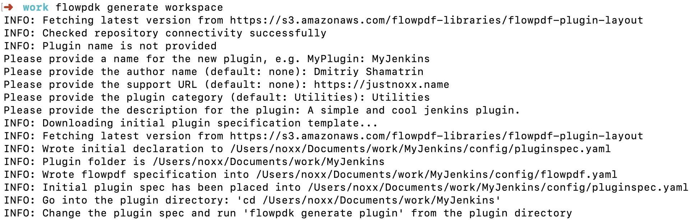

Let's see, what was generated in the workspace. There are not so many files. Now we have only 2 files:

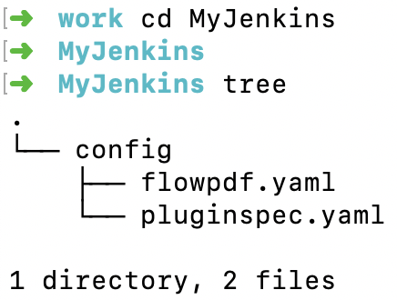

### Edit plugin spec

Remember, that we need to have a simple procedure, which will go to the jenkins instance and will get a build number from an existing job.

The pluginspec.yaml has 2 sections. configuration and procedures.

#### Updating config section

For Jenkins interaction we need to have following config values:

1. Jenkins endpoint
1. Username for authorization.
1. Password for authorization.

So, we already have endpoind field. Now we need to add basic_credential field. Make your config section like this:

```yaml
configuration:
  # Shell to be used for checking connection
  shell: ec-perl
  parameters:
   - name: config
     type: entry
     label: Configuration Name
     required: true
     documentation: The name for the created configuration
   - name: desc
     type: entry
     label: Description
     required: false
     documentation: Description for the configuration
   - name: endpoint
     label: Endpoint
     type: entry
     required: true
     documentation: A jenkins URL with port.
   - name: basic_credential
     type: credential
     label: Credential
     userNameLabel: Username
     required: true
     passwordLabel: Password
   - name: debugLevel
     # This parameter name "debugLevel" is supported by ECPDF Logger out of the box
     label: Debug Level
     type: select
     required: 0
     value: 0
     options:
       - name: Info
         value: 0
       - name: Debug
         value: 1
       - name: Trace
         value: 2
```

Before we go further, there are few details about jenkins. Jenkins has 2 things for authorization:

1. Basic authorization
1. Bread crumbs mechanism

The breadcrumbs mechanism is for XSS prevention. So, it is not enough to just use basic authorization. Each request to jenkins rest api should have a valid crumb.
This crumb is being received in response of GET request with basic auth to

```
crumbIssuer/api/json
```

Then, received content should be decoded from json and header with name of this json value crumbRequestField and with value of crumb field should be added to request.
After that, request that is sent to jenkins is valid.

Going back to our configuration section. We have following fields there:

* config: was there
* desc: was there
* endpoint: was there
* basic_credential: renamed from credential
* debugLevel: was there

As you can see, almost every field that we have in configuration was generated automatically. All that we did is labels/documentation update, and renamed credential into basic_credential.

This has been done for a reason.

As been said in documentation for FlowPDF::Context,
to have support of basic authorization by default, we must have basic_credential field in plugin config.
Also we need to have a field named authScheme that contains an autorization method. The basic authorization will be enabled only if authScheme parameter is set to basic.

We didn't add this parameter to configuration because we will use default config values mechanism, that has been described in crash course.

#### Updating procedure section

We are going to implement only one procedure: "Get Last Build Number".
Please, make your procedures section like that:

```yaml
procedures:
- name: Get Last Build Number
  description: This procedure gets last build number from provided Jenkins job.
  hasConfig: true # configuration field will be generated automatically
  parameters:
  - name: jenkinsJobName
    documentation: A name of the Jenkins job to get the latest build number.
    type: entry
    required: true
    label: Jenkins Job Name
  outputParameters:
    lastBuildNumber: A last build number for job.
  # Steps are not defined so we assume that this is one-step procedure with a single step named Deploy
  shell: ec-perl

```
We changed procedure parameters. We have declared only one parameter: jenkinsJobName, but our procedure will have 2 parameters.
The second parameter is config. Look at the hasConfig flag. This flag, when set to true, adds a config field to procedure.

Also, we added an output parameter for our procedure, where we will be storing buildNumber that we got from Jenkins.

Output parameter has name "lastBuildNumber" and description: "A last build number for job."

Finally, we can generate a plugin using that spec.

### Generation a plugin using prepared specs.

Now, when we have a pluginspec.yaml updated, we can generate actual plugin code using generate plugin command:

```
flowpdk generate plugin
```

After it you should get something like that.

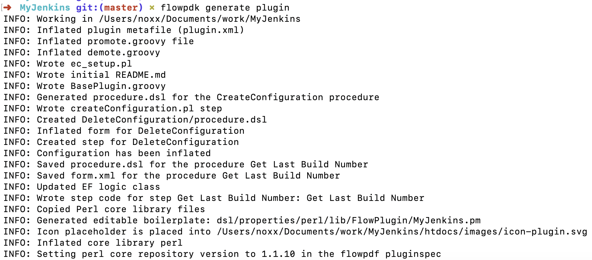

That's it. We successfully generated a plugin using plugin specs. Now we can start implementation of our features, but before we go there,
let's review what wa have generated.

## Generated plugin structure

The plugin itself contains a lot of different and sometimes complex parts. For 99% of cases dsl/properties folder is all that we need to worry about.

Currently, in dsl/properties folder we have following structure:

 * perl/core
 * perl/lib

**Important: Do not modify any file under core folder. Core folder has plugin-related internal code, which should nod be edited by plugin developer.**

The only folder that could be modified is a perl/lib folder.

dsl/properties/perl/lib/FlowPlugin/MyJenkins.pm has been generated and should be edited for new features.

Currently, right after generation, this file should be like:

```perl
package FlowPlugin::MyJenkins;
use strict;
use warnings;
use base qw/FlowPDF/;

use FlowPDF::Log;
# Feel free to use new libraries here, e.g. use File::Temp;

# Service function that is being used to set some metadata for a plugin.
sub pluginInfo {
    return {
        pluginName          => '@PLUGIN_KEY@',
        pluginVersion       => '@PLUGIN_VERSION@',
        configFields        => ['config'],
        configLocations     => ['ec_plugin_cfgs'],
        defaultConfigValues => {}
    };
}

# Auto-generated method for the procedure Get Last Build Number/Get Last Build Number
# Add your code into this method and it will be called when step runs
sub getLastBuildNumber {
    my ($pluginObject, $runtimeParameters, $stepResult) = @_;

    my $context = $pluginObject->newContext();
    logInfo("Current context is: ", $context->getRunContext());
    my $params = $context->getStepParameters();
    logInfo("Step parameters are: ", $params);

    my $configValues = $context->getConfigValues();
    logInfo("Config values are: ", $configValues);

    $stepResult->setJobStepOutcome('warning');
    $stepResult->setJobSummary("This is a job summary.");
}
## === step ends ===
# Please do not remove the marker above, it is used to place new procedures into this file.


1;

```

As you know, each plugin procedure has steps. The procedure, that we are creating right now, has step, that is named "Get Last Build Number".
When you install this plugin into your instance of CloudBees Flow and promote it, you will have a procedure called "Get Last Build Number".

So, this procedure will be running your getLastBuildNumber function from MyJenkins.pm. To get these details we need to look at the step file.

This step file is located at dsl/procedures/GetLastBuildNumber/steps/GetLastBuildNumber.pl

And you could find there:

```perl

$[/myProject/perl/core/scripts/preamble.pl]

use FlowPlugin::MyJenkins;
# Auto generated code of plugin step
# Go to dsl/properties/perl/lib/EC/Plugin/MyJenkins.pm and change the function "getLastBuildNumber"
FlowPlugin::MyJenkins->runStep('Get Last Build Number', 'Get Last Build Number', 'getLastBuildNumber');

```

This file says explicitly, where you can find the code for your procedure. So, let's get started.

## Writing a code for our new plugin

Remember, when we was looking at config values, we had notes about basis\_credential parameter and authScheme.
It's been said, that we will use default config values. It is time to use them.

### Adding default config values:

Let's edit pluginInfo function. Now it should be:

```perl
sub pluginInfo {
    return {
        pluginName          => '@PLUGIN_KEY@',
        pluginVersion       => '@PLUGIN_VERSION@',
        configFields        => ['config'],
        configLocations     => ['ec_plugin_cfgs'],
        defaultConfigValues => {
            authScheme => 'basic'
        },
    };
}
```

We've added authScheme default config value, that will be added to config values of the plugin as it was added into plugin configuration and set to basic.

### Adding imports

Since Jenkins returns a JSON, we want logs and we need to die on errors, we need to import additional libraries.
Update your imports section to be like:

```perl
package FlowPlugin::MyJenkins;
use strict;
use warnings;
use base qw/FlowPDF/;

use FlowPDF::Log;
use FlowPDF::Helpers qw/bailOut/;
use Data::Dumper;
use JSON;
use Try::Tiny;

```

### Implementing bread crumbs

As been said, FlowPDF know how to deal with basic auth by itself if special parameters has been added to configuration with certain values.
So, all that we need to do is to create REST client using context, then issue bread crumb request and then get crumbs.

Since we have runtime parameters already there (they are just merged step and config parameters, please, see FlowPDF::Context documentation for details)
and we know how to call jenkins, we need to have a function, that will build for us an URL of request.
Let's write it:

```perl
sub getBaseUrl {
    my ($self, $url) = @_;
    
    if (!$url) {
        bailOut("URL is mandatory parameter");
    }
    # retrieving runtime parameters
    my $runtimeParameters = $self->getContext()->getRuntimeParameters();
    # endpoint is a field from configuration
    my $endpoint = $runtimeParameters->{endpoint};
    
    # removing trailing slash.
    $endpoint =~ s|\/+$||gs;
    
    # appending url
    my $retval = $endpoint . '/' . $url;
    return $retval;
}
```

For example, if we call this function against:

```perl
my $crumbUrl = $self->getBaseUrl('crumbIssuer/api/json');
```

We will have in $crumpUrl concatenated url for jenkins crumb issuer request.

Now, let's implement actual crumb retrieval:

```perl
sub addBreadCrumbsToRequest {
    my ($self, $request) = @_;
    
    # Creating base URL using previously implemented function
    my $crumbUrl = $self->getBaseUrl('crumbIssuer/api/json');
    # Creating REST client object
    my $rest = $self->getContext()->newRESTClient();
    # Creating crumb request object
    my $crumbRequest = $rest->newRequest(GET => $crumbUrl);
    # actual request.
    my $response = $rest->doRequest($crumbRequest);

    if ($response->code() > 399) {
        return $request;
    }

    my $decodedResponse;
    try {
        $decodedResponse = decode_json($response->decoded_content());
    };

    if ($decodedResponse->{crumb} && $decodedResponse->{crumbRequestField}) {
        $request->header($decodedResponse->{crumbRequestField} => $decodedResponse->{crumb});
    }
    return $request;
}

```

Please, note, that this function does not have direct basic authorization. Basic auth is handled by the FlowPDF behind the scene, providing only nice APIs.

### Retrieving build number

Now we have a function, that adds a bread crumbs for HTTP::Request object. It means, that we can implement build number retrieval now:

```perl
sub retrieveLastBuildNumberFromJob {
    my ($self, $jobName) = @_;

    if (!$jobName) {
        bailOut "Missing jobName for retrieveLastBuildNumberFromJob";
    }
    # Retrieving base URL for jenkins job.
    my $baseUrl = $self->getBaseUrl(
        sprintf('job/%s/api/json', $jobName)
    );
    
    # getting rest client
    my $rest = $self->getContext()->newRESTClient();
    # creating request object
    my $request = $rest->newRequest(GET => $baseUrl);
    # autmenting this request with crumbs
    $request = $self->addBreadCrumbsToRequest($request);
    # performing request:
    my $response = $rest->doRequest($request);
    # decoding request content:
    my $json = decode_json($response->decoded_content());
    # finding and returning build number.
    if ($json->{lastBuild} && $json->{lastBuild}->{number}) {
        return $json->{lastBuild}->{number};
    }
    return undef;
}
```

### Modifying step code

Now we have step function that looks like:

```perl
sub getLastBuildNumber {
    my ($pluginObject, $runtimeParameters, $stepResult) = @_;

    my $context = $pluginObject->newContext();
    logInfo("Current context is: ", $context->getRunContext());
    my $params = $context->getStepParameters();
    logInfo("Step parameters are: ", $params);

    my $configValues = $context->getConfigValues();
    logInfo("Config values are: ", $configValues);

    $stepResult->setJobStepOutcome('warning');
    $stepResult->setJobSummary("This is a job summary.");
}

```

Let's perform cleanup and add some logic:

```perl
sub getLastBuildNumber {
    my ($pluginObject, $runtimeParameters, $stepResult) = @_;

    my $buildNumber = $pluginObject->retrieveLastBuildNumberFromJob($runtimeParameters->{jenkinsJobName});
    unless ($buildNumber) {
        bailOut("No buildNumber for jenkins job.");
    }
}
```

Now this function retrieves a last build number from jenkins. Now we need to add some output parameters and set summaries.

### Setting output parameters

To set an output parameter we will use $stepResult object, that is being passed to our step function, like that:

```perl
    $stepResult->setOutputParameter(lastBuildNumber => $buildNumber);
```

And add this code to our step function:

```perl
sub getLastBuildNumber {
    my ($pluginObject, $runtimeParameters, $stepResult) = @_;

    my $buildNumber = $pluginObject->retrieveLastBuildNumberFromJob($runtimeParameters->{jenkinsJobName});
    unless ($buildNumber) {
        bailOut("No buildNumber for jenkins job.");
    }

    $stepResult->setOutputParameter(lastBuildNumber => $buildNumber);
}
```

Please, note, that we've added this output parameter in the configuration section at the beginning of this tutorial.

### Setting pipeline/job/jobstep results

When output parameters are set, we need to set job summaries and pipeline summaries:

```
sub getLastBuildNumber {
    my ($pluginObject, $runtimeParameters, $stepResult) = @_;

    my $buildNumber = $pluginObject->retrieveLastBuildNumberFromJob($runtimeParameters->{jenkinsJobName});
    unless ($buildNumber) {
        bailOut("No buildNumber for jenkins job.");
    }
    
    logInfo("Last Build Number for $runtimeParameters->{jenkinsJobName} is $buildNumber");
    $stepResult->setOutputParameter(lastBuildNumber => $buildNumber);
    $stepResult->setPipelineSummary("Build Number for $runtimeParameters->{jenkinsJobName}", $buildNumber);
    $stepResult->setJobSummary("Build Number for $runtimeParameters->{jenkinsJobName}: $buildNumber");
    $stepResult->setJobStepSummary("Build Number for $runtimeParameters->{jenkinsJobName}: $buildNumber");

}

```

That's it!

Now, we need to assemble everything and test. Now we have a complete plugin.

### Final MyJenkins.pm

After all that we did, we have following MyJenkins.pm:

```perl
package FlowPlugin::MyJenkins;
use strict;
use warnings;
use base qw/FlowPDF/;

use FlowPDF::Log;
use FlowPDF::Helpers qw/bailOut/;
use Data::Dumper;
use JSON;
use Try::Tiny;

# Feel free to use new libraries here, e.g. use File::Temp;

# Service function that is being used to set some metadata for a plugin.
sub pluginInfo {
    return {
        pluginName          => '@PLUGIN_KEY@',
        pluginVersion       => '@PLUGIN_VERSION@',
        configFields        => ['config'],
        configLocations     => ['ec_plugin_cfgs'],
        defaultConfigValues => {
            authScheme => 'basic'
        },
    };
}


# Auto-generated method for the procedure Get Last Build Number/Get Last Build Number
# Add your code into this method and it will be called when step runs
sub getLastBuildNumber {
    my ($pluginObject, $runtimeParameters, $stepResult) = @_;

    my $buildNumber = $pluginObject->retrieveLastBuildNumberFromJob($runtimeParameters->{jenkinsJobName});
    unless ($buildNumber) {
        bailOut("No buildNumber for jenkins job.");
    }

    $stepResult->setOutputParameter(lastBuildNumber => $buildNumber);
    $stepResult->setPipelineSummary("Build Number for $runtimeParameters->{jenkinsJobName}", $buildNumber);
    $stepResult->setJobSummary("Build Number for $runtimeParameters->{jenkinsJobName}: $buildNumber");
    $stepResult->setJobStepSummary("Build Number for $runtimeParameters->{jenkinsJobName}: $buildNumber");

}
## === step ends ===
# Please do not remove the marker above, it is used to place new procedures into this file.

sub retrieveLastBuildNumberFromJob {
    my ($self, $jobName) = @_;

    if (!$jobName) {
        bailOut "Missing jobName for retrieveLastBuildNumberFromJob";
    }
    # Retrieving base URL for jenkins job.
    my $baseUrl = $self->getBaseUrl(
        sprintf('job/%s/api/json', $jobName)
    );

    # getting rest client
    my $rest = $self->getContext()->newRESTClient();
    # creating request object
    my $request = $rest->newRequest(GET => $baseUrl);
    # autmenting this request with crumbs
    $request = $self->addBreadCrumbsToRequest($request);
    # performing request:
    my $response = $rest->doRequest($request);
    # decoding request content:
    my $json = decode_json($response->decoded_content());
    # finding and returning build number.
    if ($json->{lastBuild} && $json->{lastBuild}->{number}) {
        return $json->{lastBuild}->{number};
    }
    return undef;
}


sub getBaseUrl {
    my ($self, $url) = @_;

    if (!$url) {
        bailOut("URL is mandatory parameter");
    }
    # retrieving runtime parameters
    my $runtimeParameters = $self->getContext()->getRuntimeParameters();
    # endpoint is a field from configuration
    my $endpoint = $runtimeParameters->{endpoint};

    # removing trailing slash.
    $endpoint =~ s|\/+$||gs;

    # appending url
    my $retval = $endpoint . '/' . $url;
    return $retval;
}


sub addBreadCrumbsToRequest {
    my ($self, $request) = @_;

    # Creating base URL using previously implemented function
    my $crumbUrl = $self->getBaseUrl('crumbIssuer/api/json');
    # Creating REST client object
    my $rest = $self->getContext()->newRESTClient();
    # Creating crumb request object
    my $crumbRequest = $rest->newRequest(GET => $crumbUrl);
    # actual request.
    my $response = $rest->doRequest($crumbRequest);

    if ($response->code() > 399) {
        return $request;
    }

    my $decodedResponse;
    try {
        $decodedResponse = decode_json($response->decoded_content());
    };

    if ($decodedResponse->{crumb} && $decodedResponse->{crumbRequestField}) {
        $request->header($decodedResponse->{crumbRequestField} => $decodedResponse->{crumb});
    }
    return $request;
}

1;


```
## Building plugin

When we in MyJenkins plugin directory, we can build plugin using flowpdk:

```
flowpdk build
```

You will get something like:

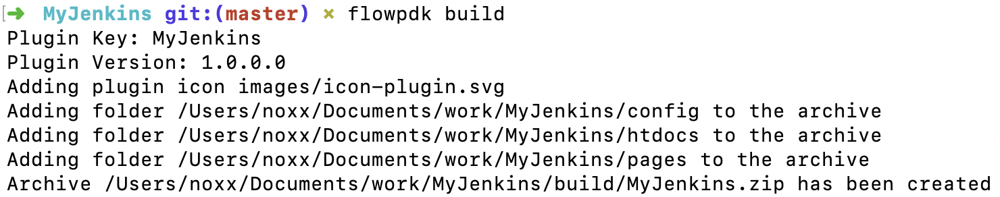

Congrats! We have created and built a plugin.

## Installing and promoting plugin

Now, go to your CloudBees Flow instance, login and click on gamburger menu, then, navigate to the plugin list:

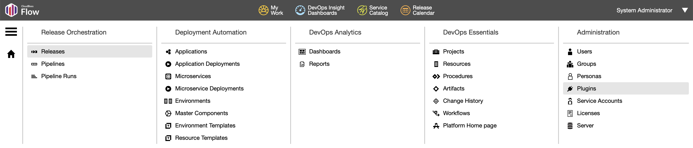

Then click on Install from File/URL tab, click Choose File, select your file and click upload:

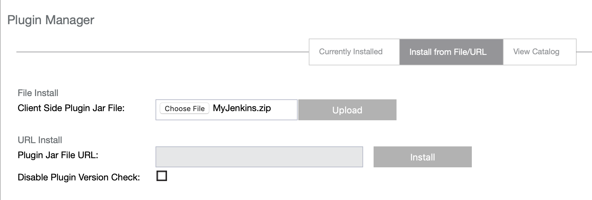

Then you will be redirected to the plugin manager table with all plugins installed. Find your plugin, MyJenkins, and click "Promote" link.

We're almost there. Let's test our plugin.

## Creating Pipeline and Configuring plugin

After your plugin is installed, navigate to Pipelines through hamburger icon and click "New" in the top right corner of the web page, you will see:

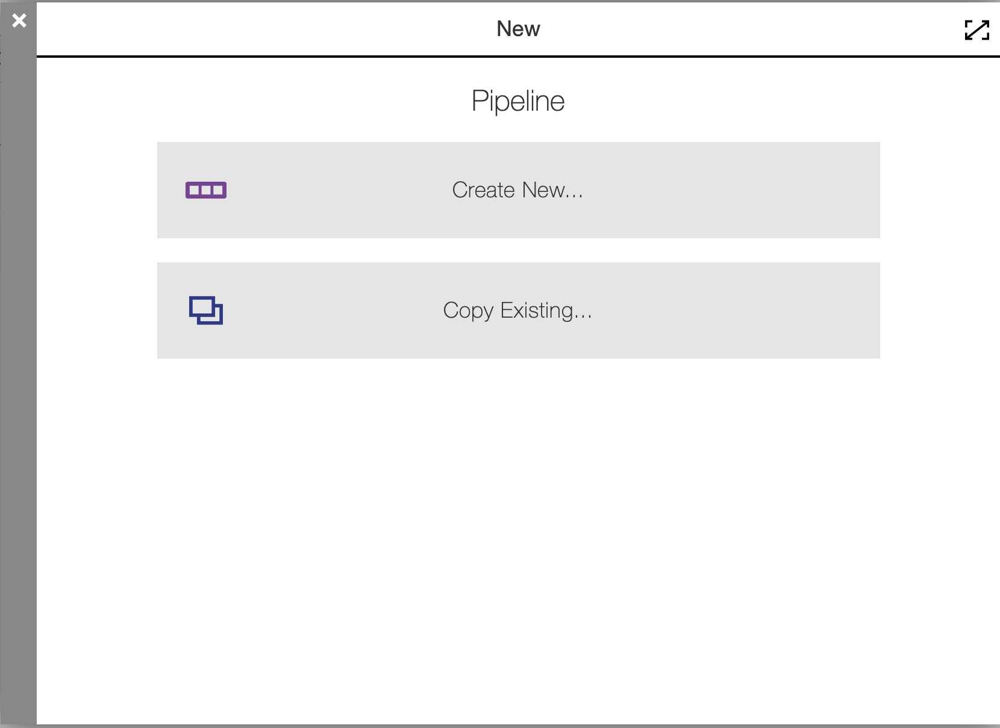

Click "Create New", enter "MyJenkinsTestPipeline", choose your project, click "Ok".

Now you're in your pipeline editor. Click "Add +" on the task explorer, enter "Get Last Build Number" and click "Select Task Type", scroll down the plugin list and click on your plugin name:

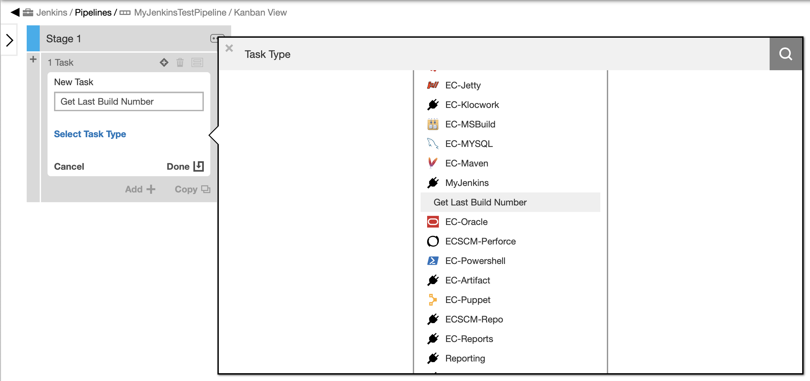

Now click on your procedure name and "Define" link then. You will see:

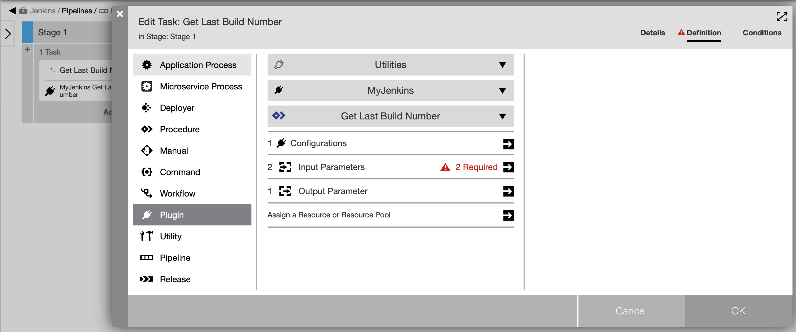

Then, click on the input parameters, and you will see 2 parameters of the procedure, that were discussed previously.

Enter Jenkins Job Name: HelloWorld, then click on triangle and click "New Configuration"

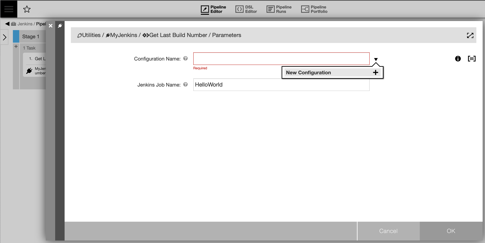

Enter values for your configuration now. In my case, Jenkins instance is located at 10.200.1.171:8080. So, I will be using it.
Username and password are admin/changeme:

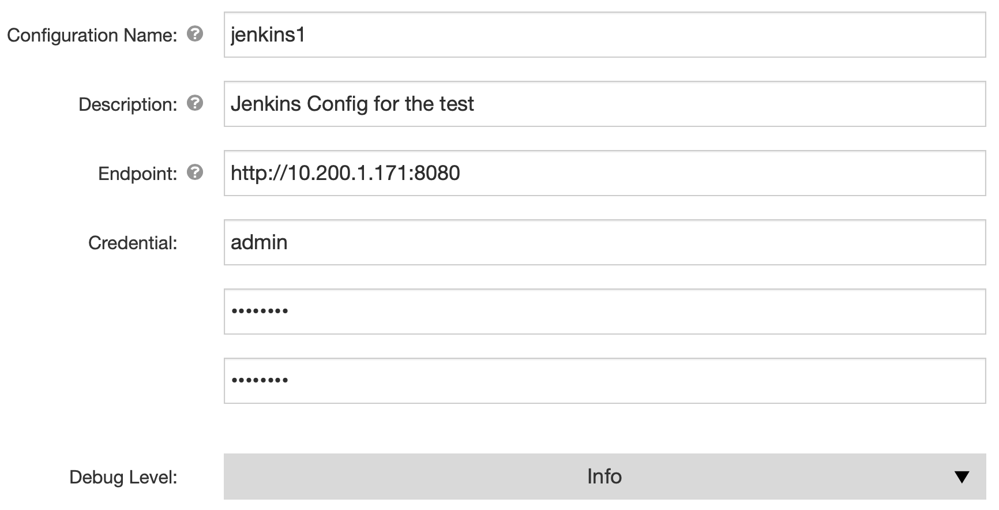

Then save configuration and select it on the Input Parameters form.

That's it.

## Running created pipeline

Now, click on the right side of the web page on run icon. You will see that, if everything is correct, following picture:

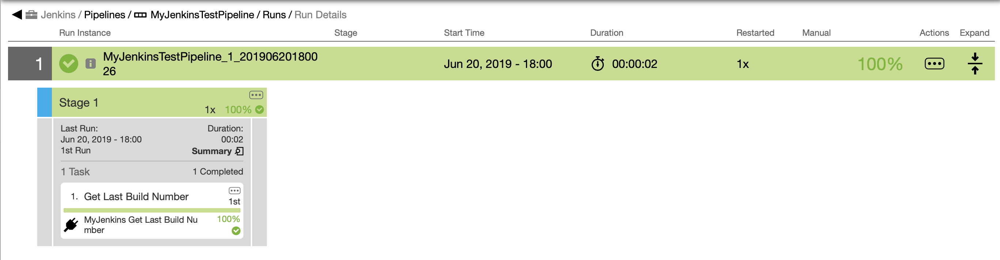

Now, click on the summary link:

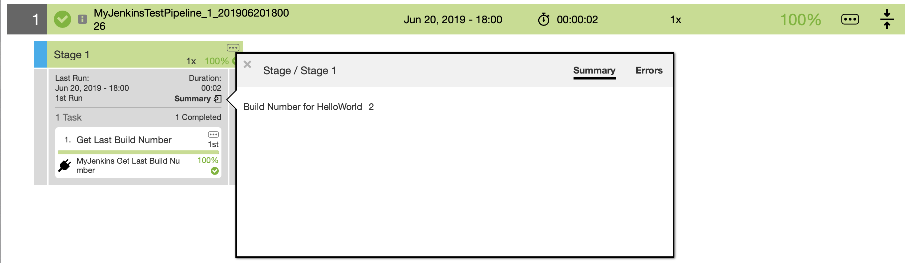

Now, click on the "1. Gert Last Build Number Link":

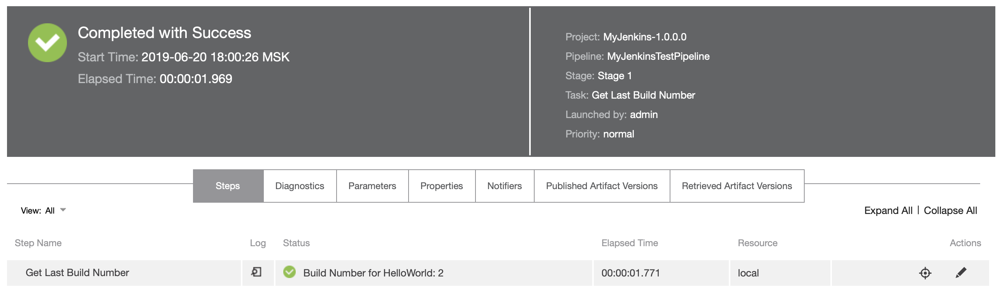

Click on the "Parameters" tab:

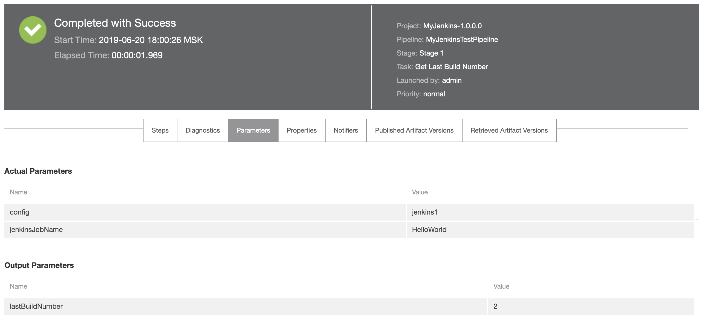

Click back on the "Steps" link and open the log link:

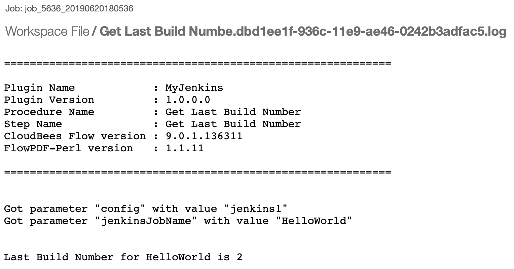


Now we have a minimal working plugin for Jenkins.

